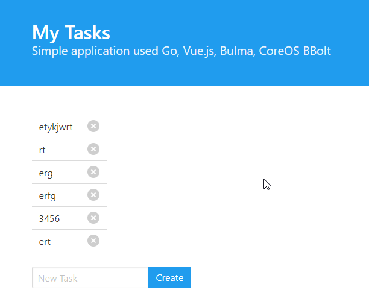

# Go TODO

This is a simple todo web app written in Go and using the Echo Framework, CoreOS BBolt and Vue.js

Just run the folowing

```
go run todo.go
```

Then point your browser to http://localhost:8000

